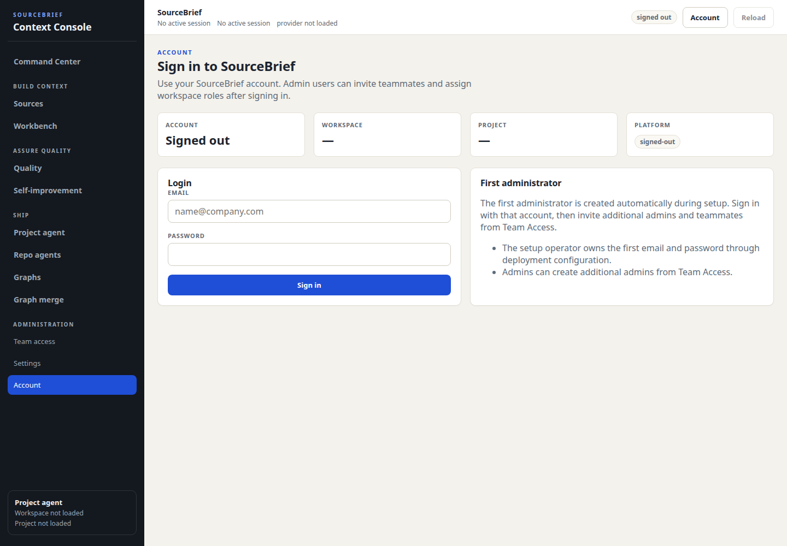
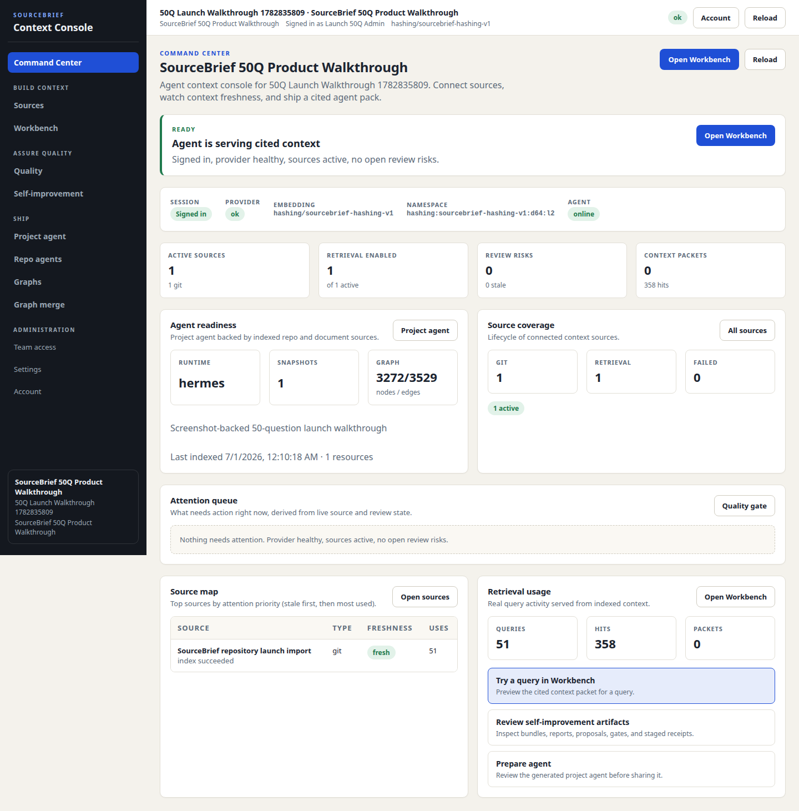
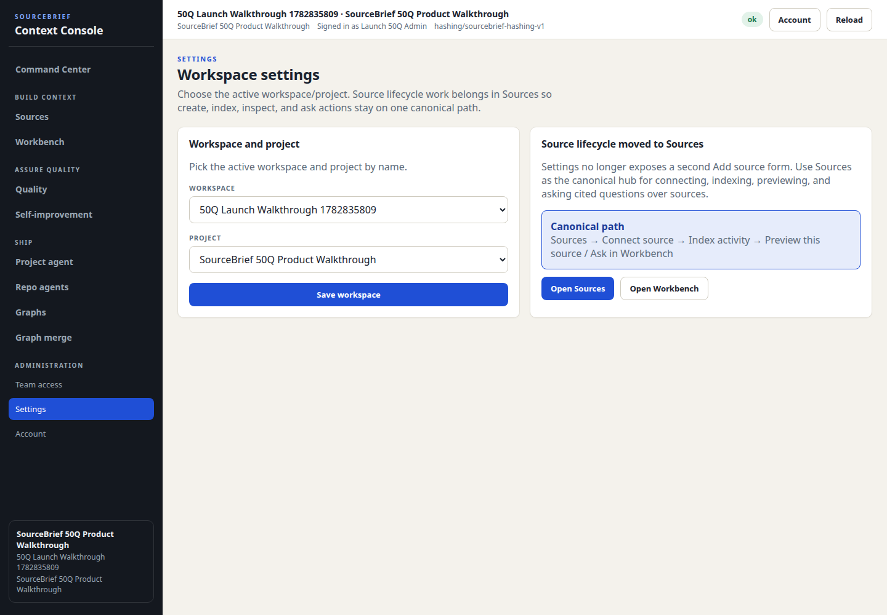
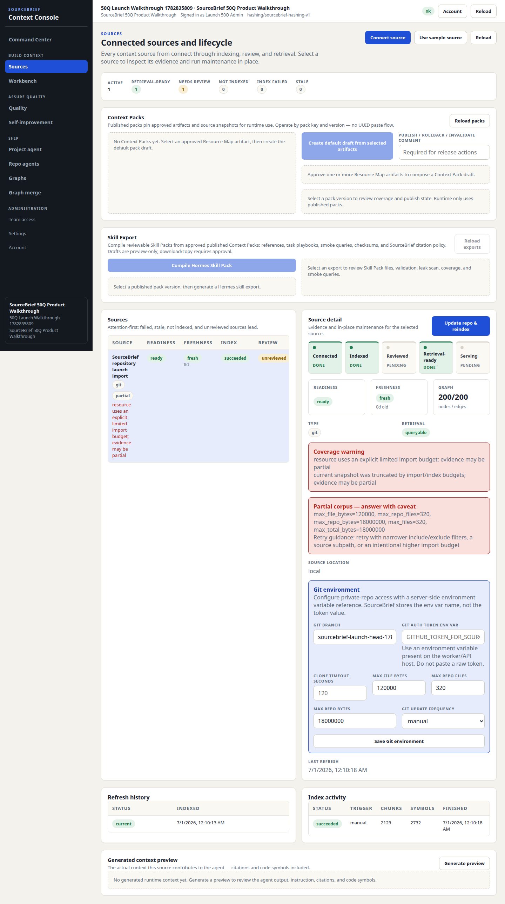
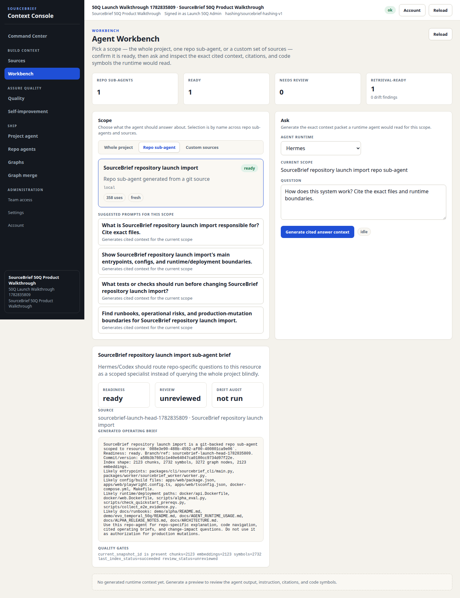
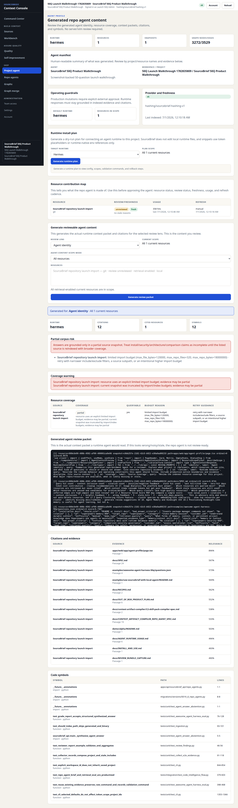
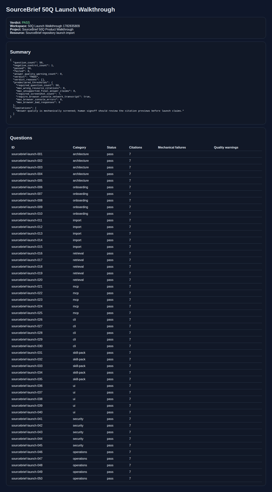

# SourceBrief current 50Q launch walkthrough

Issue: [#210](https://github.com/pingchesu/sourcebrief/issues/210)
Run date: 2026-06-30
Product commit under test: `a58b3b7601c1e40e64047ca0180cc9734d97f22e`
Local artifact bundle: `artifacts/sourcebrief-launch-50q-210-20260630160727-rerun1/`

## Verdict

`PASS`

| Check | Result |
| --- | --- |
| Question coverage | 50/50 |
| Mechanical questions | 50/50 passed |
| Answer-quality warnings | 0 |
| Negative controls | 1 |
| Index status | `succeeded` (313 docs, 2123 chunks, 2732 symbols) |
| Browser transcript | 0 console errors, 0 page errors, 0 failed requests, 0 bad responses |
| Scenario coverage | MCP tools `22`, MCP context ok, grep code ok, CLI name-first search exit `0` |
| Auth path | `session_login` |

## Predeclared PASS thresholds

```json
{
  "required_question_count": 50,
  "max_wrong_resource_citations": 0,
  "max_unsupported_final_answer_claims": 0,
  "required_screenshot_count": 7,
  "require_browser_console_network_transcript": true,
  "max_browser_console_errors": 0,
  "max_browser_bad_responses": 0
}
```

## Screenshots

1. 01 Login

   

2. 02 Dashboard

   

3. 03 Selection Settings

   

4. 04 Import Sources

   

5. 05 Workbench Citations

   

6. 06 Agent Profile

   

7. 07 Eval Report

   

## Screenshot inventory

| Screenshot | SHA-256 | Bytes |
| --- | --- | ---: |
| `01-login.png` | `sha256:c52bf0d6a770c40595e716623692b3d561f7ba4f42ac2962e0efd4f86f6363a4` | 115699 |
| `02-dashboard.png` | `sha256:514f328ed2053dd0c79f050cf2922f189845791610e3978676035732a857baa4` | 240013 |
| `03-selection-settings.png` | `sha256:60895009db79ed5b7f43d9a8795e897009789cc8b849b79a8115c3d0b2ffca7e` | 145950 |
| `04-import-sources.png` | `sha256:dd8a025e90c962c8422a3c7f0039799b035d02a5d7e7dc04fc1b7702d3f54eb2` | 405748 |
| `05-workbench-citations.png` | `sha256:2e3492963b4fb5d8dff67936c1dcc14e810256bc6bf8ea228565e6bae1cc0c0e` | 363456 |
| `06-agent-profile.png` | `sha256:a7acc9e1489f67d35633da3199c1c53c7267931cd651cfcdec82faeeba378616` | 858349 |
| `07-eval-report.png` | `sha256:cebf85bfc5c019f69f5ecd697961235ca53d9d98b8e0a8563df23929e42da36b` | 326617 |

## Browser console/network transcript

The raw transcript stays in the ignored local artifact bundle at `browser/console-network.json`; the committed summary is:

```json
{
  "path": "browser/console-network.json",
  "sha256": "sha256:35b4afdcd6717c25bf5bb86a12c286c8331d714fcca19f32ca62e93e3cc442a1",
  "console_count": 0,
  "console_error_count": 0,
  "page_error_count": 0,
  "failed_request_count": 0,
  "bad_response_count": 0,
  "runner": {
    "name": "playwright-chromium",
    "viewport": "1440x1000"
  }
}
```

## Operation path

1. Start an isolated Compose project with fresh Postgres/Redis volumes, random local ports, and `SOURCEBRIEF_DEV_AUTH=false`.
2. Bootstrap a local admin through the admin credential environment and authenticate via `/auth/login` session flow.
3. Create human-named workspace/project: `50Q Launch Walkthrough 1782835809` / `SourceBrief 50Q Product Walkthrough`.
4. Bundle the current checkout `HEAD` as a temporary branch ref for ingestion and add it as `SourceBrief repository launch import`.
5. Wait for indexing to succeed.
6. Run all 50 questions from [`examples/sourcebrief-launch-50q/questions.json`](../../examples/sourcebrief-launch-50q/questions.json).
7. Exercise MCP `tools/list`, MCP `sourcebrief.get_agent_context`, MCP `sourcebrief.grep_code`, and CLI `sourcebrief --json search` using name-first workspace/project/resource selectors.
8. Capture Playwright screenshots plus browser console/network transcript.
9. Inspect screenshots for visible tokens, raw UUIDs, or private local paths before committing this sanitized screenshot set.

## Notes

- Raw `report.json`, generated Playwright scripts, local ports, and full transcript remain under ignored `artifacts/`.
- The committed screenshots intentionally show human-readable workspace/project/resource labels and do not expose bearer tokens, raw UUIDs, or local filesystem paths.
- This run closes the #210 current screenshot-backed proof gap. Broader launch readiness still depends on the remaining launch train items (#211, #212, #213, #214, and parent #208).
